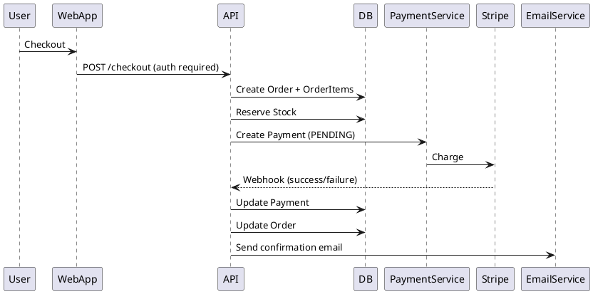

# SPEC-1-Amazon-like E-Commerce App

## Background

This design addresses the need for a startup to launch a **minimum viable e-commerce platform** inspired by Amazon’s core shopping experience. The goal is to enable real users to browse products, place orders, and complete payments with a reliable, scalable, and maintainable system while keeping infrastructure complexity and costs low.

The system is designed as a **single-seller retail platform**, meaning all inventory is owned and managed by the business itself. This significantly simplifies fulfillment, pricing, and seller management while still allowing future evolution into a multi-vendor marketplace if needed.

The architecture prioritizes:
- Fast time-to-market
- Clean separation of concerns
- Cloud-native scalability
- API-first design for future mobile apps

---

## Requirements

### Must Have (M)
- User registration and authentication (email/password)
- Password reset via email (forgot/reset flow)
- JWT-based authentication with refresh tokens
- Role-based access control (`Customer`, `Admin`)
- **Product catalog browsing with pagination (default 20 items/page)**
- **Product search by keyword (name + description)**
- Product detail pages (images, price, description, stock)
- Shopping cart (authenticated users only)
- **Stock validation when adding/updating cart items**
- Checkout flow
- Online payment processing via third-party provider
- Payment tracking and retries
- Order creation and persistence
- Order status tracking (PLACED, PAID, SHIPPED, DELIVERED, CANCELLED)
- Order confirmation email
- Admin ability to manage products and inventory
- HTTPS-only communication

### Should Have (S)
 (S)
- User order history
- Order cancellation (rules-based)
- Basic product ratings (1–5 stars)
- Stock validation during cart operations
- Email delivery failure retry

### Could Have (C)
- Wishlist / save-for-later
- Discount codes
- Product analytics dashboard

### Won’t Have (W) – MVP Exclusions
- Anonymous carts or guest checkout
- Multi-seller marketplace
- Advanced search (full-text / Elasticsearch)
- Recommendation engine
- Native mobile apps

## Method

### High-Level Architecture

The system follows a **N-Tier** optimized for a startup MVP.

**Core Components:**
- **Web Frontend**: React (Next.js)
- **Backend API**: ASP.NET Core (C#)
- **ORM**: Entity Framework Core
- **Database**: PostgreSQL
- **Cache**: ASP.NET Core IMemoryCache
- **Object Storage**: S3-compatible storage (local filesystem for dev)
- **Payments**: Stripe (via abstraction)
- **Email Service**: **Pluggable provider interface** (SendGrid / AWS SES)
- **Auth**: JWT + Refresh Tokens
- **Background Jobs**: Hosted services (emails, order timeouts)

All external providers are accessed via interfaces to allow easy replacement.

---


### Core Domain Models & Database Schema

> **Product Decisions (MVP):**
> - Cart usage requires authenticated users (no anonymous carts)
> - Orders store shipping address as an immutable JSON snapshot
> - PostgreSQL + EF Core 
> - Stock is reserved at order creation and restored on payment failure/timeout
> - Only order confirmation emails are sent in MVP

### Core Domain Models & Database Schema

#### User
- `Id (GUID, PK)`
- `Name`
- `Phone`
- `Email (unique)`
- `PasswordHash`
- `Role (Customer | Admin)`
- `CreatedAt`
#### Decision note: considering soft delete or not.

---

#### RefreshToken
- `Id (GUID, PK)`
- `UserId (FK)`
- `TokenHash`
- `ExpiresAt`
- `RevokedAt (nullable)`
- `CreatedAt`

Rules:
- One active refresh token per device
- Rotated on each use
- Revoked on password change

---

#### PasswordResetToken
- `Id (GUID, PK)`
- `UserId (FK)`
- `TokenHash (unique)`
- `ExpiresAt`
- `UsedAt (nullable)`
- `CreatedAt`

Rules:
- Single-use
- Expires after 1 hour
- Invalidated after password reset

---

#### EmailNotification
```
EmailNotification:
- Id (GUID, PK)
- RecipientEmail
- Template (ORDER_CONFIRMATION | PASSWORD_RESET)
- TemplateData (JSON)
- Status (PENDING | SENT | FAILED | PERMANENTLY_FAILED)
- Attempts (int)
- MaxAttempts (int = 3)
- LastAttemptAt (nullable)
- SentAt (nullable)
- ErrorMessage (nullable)
- OrderId (FK, nullable)
- CreatedAt

Indexes:
- IX_EmailNotification_Status
- IX_EmailNotification_OrderId
```
#### WebhookEvent
```
WebhookEvent:
- Id (GUID, PK)
- EventId (string, unique) // Stripe evt_xxx
- EventType
- Payload (JSON)
- Status (PENDING | PROCESSED | FAILED)
- ProcessedAt (nullable)
- ErrorMessage (nullable)
- CreatedAt

Indexes:
- IX_WebhookEvent_EventId (unique)
- IX_WebhookEvent_Status
```

#### Product
- `Id (GUID, PK)`
- `Name`
- `Description`
- `Price`
- `StockQuantity`
- `Version` *(optimistic concurrency token)*
- `Category (enum)`
- `AverageRating (nullable)`
- `RatingCount (int, default 0)`
- `IsDeleted (bool, default false)`
- `DeletedAt (nullable)`
- `CreatedAt`

Note:
- Add `specification` field as `JSON` like RayaShop

---


#### ProductImage
- `Id (GUID, PK)`
- `ProductId (FK)`
- `ImageUrl`
- `IsPrimary`
- `DisplayOrder`
- `ContentHash` prevent duplicate image
- `CreatedAt`

Images are stored in object storage; database stores URLs only.

---


#### Rating
- `Id (GUID, PK)`
- `ProductId (FK)`
- `UserId (FK)`
- `Score (1–5)`
- `Comment (nullable)`
- `CreatedAt`

Constraints:
- Unique index on `(UserId, ProductId)`

---


#### Cart
- `Id (GUID, PK)`
- `UserId (FK, unique)`
- `UpdatedAt`

Constraints:
- One cart per user (unique index on UserId)

---


#### CartItem
- `Id (GUID, PK)`
- `CartId (FK)`
- `ProductId (FK)`
- `Quantity`
- `UnitPriceSnapshot`

---


#### Order
- `Id (GUID, PK)`
- `UserId (FK)`
- `Status (PLACED | PAID | SHIPPED | DELIVERED | CANCELLED)`
- `TotalAmount`
- `ShippingAddressSnapshot (JSON)`
- `ConfirmationEmailSent (bool)`
- `ConfirmationEmailSentAt (nullable)`
- `CreatedAt`

`OrderNumber` for the user e.g. `000421017`


> Orders do **not** reference the Address table directly.
> The selected address is copied into `ShippingAddressSnapshot` at checkout to preserve history.

---


#### OrderItem
- `Id (GUID, PK)`
- `OrderId (FK)`
- `ProductId (FK)`
- `Quantity`
- `UnitPrice`

---

#### Payment
- `Id (GUID, PK)`
- `OrderId (FK)`
- `PaymentProviderId`
- `Amount`
- `Status (PENDING | COMPLETED | FAILED | REFUNDED)`
- `PaymentMethod`
- `CreatedAt`

---

#### Address
- `Id (GUID, PK)`
- `UserId (FK)`
- `FullName`
- `PhoneNumber`
- `Country`
- `Governorate`
- `Area`
- `Street`
- `BulidingNumber`
- `Floor`
- `Apartment`
- `AddressName`
- `IsDefault`

---


### Key Workflows

#### Product Browsing, Pagination & Search

**Pagination Rules:**
- Default page size: 20
- Max page size: 100
- Offset-based pagination for MVP

**Search Strategy (MVP):**
- Case-insensitive `LIKE` search
- Fields searched: `Product.Name`, `Product.Description`
- Only active products: `IsDeleted = false`

Example SQL:
```
WHERE IsDeleted = false
  AND (Name LIKE '%keyword%' OR Description LIKE '%keyword%')
ORDER BY CreatedAt DESC
LIMIT @PageSize OFFSET @Offset
```

---

#### Cart Operations & Stock Validation

When adding or updating a cart item:
1. Validate `Product.IsDeleted = false`
2. Validate `Product.StockQuantity >= requested quantity`
3. Set `CartItem.UnitPriceSnapshot = Product.Price`
4. Save cart changes

> Note: This is **soft validation**. Final stock validation still occurs at checkout.

---

#### Rating Creation & Recalculation

When a rating is created, updated, or deleted:
1. Perform Rating change
2. Recalculate:
   - `Product.RatingCount = COUNT(Rating)`
   - `Product.AverageRating = AVG(Rating.Score)`
3. Update Product in same transaction

---

#### Checkout, Stock Reservation & Payment

**Policy:** Stock is reserved immediately when an order is placed.

1. User must be authenticated
2. User initiates checkout
3. Backend validates stock availability
4. **BEGIN TRANSACTION**
   - Create Order (status: `PLACED`)
   - Copy selected Address → `ShippingAddressSnapshot`
   - For each CartItem:
     - Create OrderItem
     - Decrement Product.StockQuantity using optimistic concurrency
   - Calculate Order.TotalAmount
   - Clear CartItems
5. **COMMIT TRANSACTION**
6. Create Payment (status: `PENDING`)
7. Initiate Stripe charge
8. Stripe webhook callback:
   - On success:
     - Update Payment → `COMPLETED`
     - Update Order → `PAID`
     - Send order confirmation email
   - On failure:
     - Update Payment → `FAILED`
     - Restore stock quantities
     - Update Order → `CANCELLED`

**Timeout Rule:**
- If Payment remains `PENDING` > 30 minutes → auto-cancel order and restore stock

---



---

### Similar Existing Systems

- **Shopify (single-merchant mode)** – clean admin + checkout
- **Amazon Retail (simplified)** – inventory-owned model
- **Stripe Checkout** – offloaded payment complexity

These systems validate using a **centralized order service** with external payment handling.

---

### Database Indexes (Required)

```sql
CREATE INDEX IX_User_Email ON User(Email);
CREATE INDEX IX_Product_Category ON Product(Category);
CREATE INDEX IX_Product_Active_Category ON Product(Category) WHERE IsDeleted = false;
CREATE INDEX IX_Product_AverageRating ON Product(AverageRating DESC);
CREATE INDEX IX_CartItem_CartId ON CartItem(CartId);
CREATE INDEX IX_CartItem_ProductId ON CartItem(ProductId);
CREATE INDEX IX_Order_UserId_CreatedAt ON Order(UserId, CreatedAt DESC);
CREATE INDEX IX_Order_Status ON Order(Status);
CREATE INDEX IX_OrderItem_OrderId ON OrderItem(OrderId);
CREATE INDEX IX_OrderItem_ProductId ON OrderItem(ProductId);
CREATE INDEX IX_Payment_OrderId ON Payment(OrderId);
CREATE INDEX IX_Rating_ProductId ON Rating(ProductId);
CREATE UNIQUE INDEX IX_Rating_UserId_ProductId ON Rating(UserId, ProductId);
CREATE INDEX IX_Address_UserId ON Address(UserId);
CREATE INDEX IX_ProductImage_ProductId ON ProductImage(ProductId, DisplayOrder);
```

---
