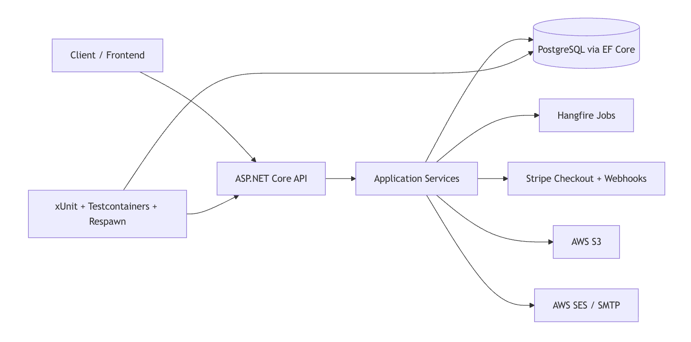

# Commerce API

Backend API for a single-seller e-commerce platform built with ASP.NET Core, Entity Framework Core, PostgreSQL, Stripe, AWS integrations, Hangfire, and a layered test suite.

This repository contains the backend only. It exposes an API-first commerce system that can be consumed by a web or mobile client for browsing products, managing carts, checking out, tracking orders, and administering catalog and order workflows.

## Table of Contents

- [Overview](#overview)
- [What This Project Demonstrates](#what-this-project-demonstrates)
- [Features](#features)
- [Tech Stack](#tech-stack)
- [Architecture](#architecture)
- [Important Design Details](#important-design-details)
- [Core Domain Model](#core-domain-model)
- [API Reference](#api-reference)
- [Getting Started](#getting-started)
- [Configuration Reference](#configuration-reference)
- [Testing](#testing)
- [CI / Automation](#ci--automation)
- [Project Structure](#project-structure)
- [Challenges / Lessons Learned](#challenges--lessons-learned)
- [Future Improvements](#future-improvements)
- [Documentation Notes](#documentation-notes)

## Overview

Commerce API models the core backend of an Amazon-like shopping experience for a single retail business. The system supports customer authentication, product and image management, ratings, saved addresses, authenticated carts, checkout with card or cash-on-delivery payment, order state transitions, Stripe webhook processing, queued transactional email, and admin order operations.

The project is structured to show production-oriented backend engineering: clear project boundaries, provider abstractions, centralized validation and error handling, database constraints, background processing, and integration tests that run against real PostgreSQL containers.

## What This Project Demonstrates

- Secure authentication with JWT access tokens, hashed refresh tokens, token rotation, token-family reuse detection, logout, logout-all, and password reset.
- E-commerce domain workflows including carts, stock validation, checkout, order creation, order cancellation, refunds, ratings, address snapshots, and admin order transitions.
- Payment integration through Stripe embedded Checkout, webhook signature verification, idempotent webhook storage, session status checks, and refund support.
- Transactional email pipeline using persisted email notifications, HTML template rendering, retry tracking, SMTP for development, and AWS SES for production.
- Background processing with Hangfire for email delivery, payment timeout handling, and cleanup of stale tokens and failed notifications.
- Operational hardening with configurable CORS, built-in rate limiting, a `/health` endpoint, HSTS outside development, and Swagger JWT Bearer support.
- PostgreSQL schema design with EF Core migrations, check constraints, indexes, JSON-owned values, global query filters, and optimistic concurrency through PostgreSQL `xmin`.
- Test strategy using xUnit, Testcontainers, Respawn, NSubstitute, Shouldly, and focused unit/integration test coverage.

## Features

### Authentication And Account Security

- Customer registration and login.
- BCrypt password hashing.
- JWT access tokens with configurable issuer, audience, signing key, and expiration.
- Refresh token rotation with hashed token storage.
- Token-family tracking and reuse detection. Replaying a rotated token revokes the whole token family.
- Single-session logout and all-device logout.
- Forgot-password and reset-password flow backed by single-use reset tokens.
- Password reset revokes active refresh tokens.

### Product Catalog

- Public product listing and product detail endpoints.
- Product categories, price, stock, average rating, rating count, specifications, and images.
- Product specifications stored as JSON-owned values.
- Soft delete for products through a global EF Core query filter.
- Admin-only product create, update, and delete operations.

### Product Images

- Admin-only image uploads.
- AWS S3-backed storage abstraction.
- File validation for size and extension.
- SHA-256 content hashing to prevent duplicate image uploads per product.
- Primary image selection.
- Automatic primary-image promotion when needed.

### Ratings

- Authenticated customers can create, update, and delete product ratings.
- Public endpoint for reading product ratings.
- One rating per user per product enforced by a unique database index.
- Product average rating and rating count are recalculated in the same transaction as rating changes.

### Addresses

- Authenticated customers can create, update, list, and delete addresses.
- One default address is maintained per user at the service layer.
- The first address becomes default automatically.
- Orders store an immutable address snapshot instead of referencing the mutable address row.

### Cart

- Authenticated cart only.
- One cart per user.
- Lazy cart creation on first cart access.
- Add, update, remove, and clear cart items.
- Stock validation on add and update.
- Unit price snapshot stored on each cart item.
- Cart subtotal returned from the API.

### Checkout And Orders

- Checkout creates an order from the authenticated user's cart.
- Checkout validates stock, reserves inventory, persists order items, and clears the cart in a database transaction.
- Supports `card` and `cash_on_delivery` payment methods.
- Human-readable order numbers generated from a PostgreSQL sequence.
- Customer order history with pagination.
- Customer order details.
- Customer cancellation rules.
- Admin order listing and status updates.
- Order state machine:
  - `Placed`
  - `Paid`
  - `Shipped`
  - `Delivered`
  - `Cancelled`

### Payments And Webhooks

- Stripe embedded Checkout session creation for card payments.
- Cash-on-delivery payment records for bookkeeping.
- Stripe session status endpoint.
- Stripe webhook endpoint with raw-body signature verification.
- Idempotent webhook handling through a unique Stripe event id.
- Raw webhook payload stored as JSONB for auditability and replay.
- Checkout completion marks payment completed and order paid.
- Checkout expiration or timeout fails payment, cancels order, and restores stock.
- Refund support when completed payments are cancelled.

### Email And Background Jobs

- Email notifications are stored before delivery.
- Hangfire recurring email job processes pending and failed notifications.
- Retry accounting with max attempts and permanent failure status.
- SMTP delivery in development.
- AWS SES delivery in non-development environments.
- HTML templates for order confirmation and password reset.
- Payment timeout job cancels stale pending card payments and restores stock.
- Cleanup job removes expired reset tokens, old revoked refresh tokens, and stale permanently failed email notifications.

## Tech Stack

| Area | Technology |
| --- | --- |
| Runtime | .NET 10, ASP.NET Core |
| Language | C# |
| API | ASP.NET Core Controllers, Swagger / Swashbuckle |
| Data Access | Entity Framework Core |
| Database | PostgreSQL |
| Auth | JWT Bearer authentication, BCrypt |
| Validation | FluentValidation |
| Payments | Stripe.net |
| Background Jobs | Hangfire, Hangfire.PostgreSql |
| Storage | AWS S3 |
| Email | SMTP / MailKit for development, AWS SES for production |
| Testing | xUnit, Testcontainers for PostgreSQL, Respawn, NSubstitute, Shouldly, Bogus |
| Local Services | Docker Compose, PostgreSQL, Mailpit |

## Architecture

The solution follows a layered backend architecture:



```text
Client
  |
  v
Commerce.Api
  Controllers, endpoint constants, DTO mappings, middleware, Swagger, auth pipeline
  |
  v
Commerce.Application
  Domain models, EF Core DbContext/configurations, services, validators, jobs, provider adapters
  |
  v
PostgreSQL / Stripe / AWS S3 / AWS SES / SMTP
```

Project responsibilities:

- `Commerce.Api`: HTTP entry point, controllers, route constants, mapping extensions, global exception middleware, Swagger, authentication, authorization, and Hangfire dashboard registration.
- `Commerce.Application`: domain behavior, application services, EF Core database model, migrations, validation, background jobs, auth/token logic, payment adapter, email services, and storage adapter.
- `Commerce.Contracts`: request and response DTOs shared by the API boundary.
- `Commerce.Tests`: unit and integration tests for validators, services, endpoints, jobs, email templates, auth, carts, ratings, addresses, orders, and admin workflows.
- `Docs`: planning/specification notes used during project design, plus README assets.

### Architecture Decisions

- **Layered architecture:** The project is structured as a modular backend rather than a single mixed project. This keeps HTTP concerns, business workflows, database mapping, validation, and provider integrations separated without adding microservice-level operational complexity.
- **Contracts project:** `Commerce.Contracts` contains request and response DTOs so the API does not expose EF Core entities directly. This keeps the external API shape stable while domain and persistence details can evolve internally.
- **Direct `AppDbContext` usage in services:** The services use EF Core directly instead of adding a generic Repository and Unit of Work layer. EF Core already provides repository-like access through `DbSet<T>` and unit-of-work behavior through `DbContext.SaveChangesAsync()`. Adding another abstraction here would mostly wrap EF Core, hide useful features such as transactions, includes, concurrency handling, and batch updates, and add little value for this project.
- **Interfaces where they add value:** External dependencies such as Stripe, email delivery, and storage are behind interfaces because those boundaries are integration points that need substitution in tests and future provider changes.

## Important Design Details

### Error Handling

Application-specific exceptions derive from `AppException` and are translated by `GlobalExceptionMiddleware` into consistent JSON responses:

```json
{
  "error": "Human readable message.",
  "code": "ERROR_CODE"
}
```

Validation responses may include a `details` object with field-level errors.

### Validation

FluentValidation validators are registered from the application assembly and cover users, products, ratings, addresses, carts, orders, payments, webhook events, email notifications, refresh tokens, and password reset tokens.

### Data Integrity

The database model uses:

- Unique indexes for user email, cart ownership, rating ownership, product image content hashes, order numbers, and Stripe event ids.
- Check constraints for rating score, cart item quantity, order status, payment status, email notification status, email attempts, and webhook status.
- JSON-owned values for product specifications and order address snapshots.
- Global query filters for soft-deleted products and dependent product data.
- PostgreSQL `xmin` as a row-version token for product concurrency.

### Background Processing

Hangfire is configured with PostgreSQL storage. In non-testing environments, the API registers:

- `EmailSenderJob`: every minute.
- `PaymentTimeoutJob`: every five minutes.
- `CleanupJob`: daily at 02:00 UTC.

The Hangfire dashboard is available at `/hangfire`. Development mode allows local dashboard access; non-development access is restricted to authenticated admin users.

### API Runtime Hardening

The API includes production-oriented startup defaults:

- Configurable CORS through `Cors:AllowedOrigins`.
- Global rate limiting partitioned by authenticated user id or client IP.
- Stricter rate limiting for authentication-sensitive endpoints.
- `/health` endpoint for container and hosting probes.
- HSTS outside development.
- Swagger UI Bearer authentication support for testing protected endpoints.

Rate limiting is disabled in the `Testing` environment.

## Core Domain Model

Primary entities:

- `User`: customer/admin account, password hash, role, refresh tokens, reset tokens, addresses, cart, orders, and ratings.
- `RefreshToken`: hashed refresh token with family tracking, revocation reason, rotation chain, and expiry.
- `PasswordResetToken`: hashed single-use password reset token.
- `Product`: catalog item with price, stock, category, specifications, rating stats, images, soft-delete state, and concurrency token.
- `ProductImage`: S3 URL, primary flag, display order, and content hash.
- `Rating`: one customer rating per product.
- `Address`: customer shipping address with default-address behavior.
- `Cart` and `CartItem`: authenticated cart with price snapshots.
- `Order` and `OrderItem`: immutable checkout result with status transitions and address snapshot.
- `Payment`: payment bookkeeping for card and cash-on-delivery orders.
- `WebhookEvent`: idempotent Stripe event audit log.
- `EmailNotification`: queued email delivery record with retry state.

### Domain Relationships

High-level relationship map:

```text
User
+-- RefreshTokens
+-- PasswordResetTokens
+-- Addresses
+-- Cart
|   +-- CartItems
+-- Orders
|   +-- OrderItems
|   +-- Payment
|   +-- EmailNotifications
+-- Ratings

Product
+-- ProductImages
+-- Ratings
+-- CartItems
+-- OrderItems

Order
+-- owns AddressSnapshot
+-- has one Payment
+-- has many OrderItems
+-- may have EmailNotifications

WebhookEvent
+-- standalone Stripe event audit and idempotency record
```

Notable modeling decisions:

- Orders store an `AddressSnapshot` instead of referencing the live `Address` row, so historical orders do not change when a customer edits or deletes an address later.
- Products are soft-deleted and hidden through global query filters, while order history is preserved.
- `WebhookEvent` is intentionally standalone because it represents provider event processing, not customer-owned domain data.

## API Reference

All endpoints are prefixed with `/api`.

### Auth

| Method | Path | Description |
| --- | --- | --- |
| `POST` | `/api/auth/register` | Register a customer and issue tokens |
| `POST` | `/api/auth/login` | Authenticate and issue tokens |
| `POST` | `/api/auth/refresh` | Rotate refresh token and issue a new token pair |
| `POST` | `/api/auth/logout` | Revoke one refresh token |
| `POST` | `/api/auth/logout-all` | Revoke all active user sessions |
| `POST` | `/api/auth/forgot-password` | Queue password reset email |
| `POST` | `/api/auth/reset-password` | Reset password with a valid reset token |

### Products

| Method | Path | Description |
| --- | --- | --- |
| `GET` | `/api/products?page=&pageSize=&category=&search=&sortBy=` | List products with pagination, search, filtering, and sorting |
| `GET` | `/api/products/{id}` | Get product details |
| `POST` | `/api/admin/products` | Create product, admin only |
| `PUT` | `/api/admin/products/{id}` | Update product, admin only |
| `DELETE` | `/api/admin/products/{id}` | Soft-delete product, admin only |

### Product Images

| Method | Path | Description |
| --- | --- | --- |
| `POST` | `/api/admin/products/{productId}/images` | Upload product image, admin only |
| `GET` | `/api/products/{productId}/images/{imageId}` | Get image metadata |
| `DELETE` | `/api/admin/products/{productId}/images/{imageId}` | Delete image, admin only |
| `PUT` | `/api/admin/products/{productId}/images/{imageId}/set-primary` | Set primary image, admin only |

### Ratings

| Method | Path | Description |
| --- | --- | --- |
| `POST` | `/api/products/{productId}/ratings` | Create rating, authenticated |
| `GET` | `/api/products/{productId}/ratings` | List product ratings |
| `PUT` | `/api/ratings/{id}` | Update own rating |
| `DELETE` | `/api/ratings/{id}` | Delete own rating |

### Addresses

| Method | Path | Description |
| --- | --- | --- |
| `GET` | `/api/addresses` | List current user's addresses |
| `POST` | `/api/addresses` | Create address |
| `PUT` | `/api/addresses/{id}` | Update own address |
| `DELETE` | `/api/addresses/{id}` | Delete own address |

### Cart

| Method | Path | Description |
| --- | --- | --- |
| `GET` | `/api/cart` | Get or create current user's cart |
| `POST` | `/api/cart/items` | Add item |
| `PUT` | `/api/cart/items/{id}` | Update item quantity |
| `DELETE` | `/api/cart/items/{id}` | Remove item |
| `DELETE` | `/api/cart` | Clear cart |

### Checkout And Orders

| Method | Path | Description |
| --- | --- | --- |
| `POST` | `/api/checkout` | Create order from cart |
| `GET` | `/api/checkout/session-status?sessionId=...` | Get Stripe checkout session status |
| `GET` | `/api/orders` | List current user's orders with pagination |
| `GET` | `/api/orders/{id}` | Get current user's order details |
| `POST` | `/api/orders/{id}/cancel` | Cancel current user's order when allowed |

### Admin Orders

| Method | Path | Description |
| --- | --- | --- |
| `GET` | `/api/admin/orders` | List all orders with pagination, admin only |
| `PUT` | `/api/admin/orders/{id}/status` | Move order through valid state transition, admin only |

### Webhooks

| Method | Path | Description |
| --- | --- | --- |
| `POST` | `/api/webhooks/stripe` | Receive Stripe checkout events |

## Getting Started

### Prerequisites

- Docker and Docker Compose.
- .NET 10 SDK if running the API locally or running tests.
- Stripe test keys if using card checkout.
- AWS credentials and S3 bucket if using product image upload.
- AWS SES configuration if running outside development.

### Clone The Repository

```bash
git clone https://github.com/mhm000d/commerce-api.git
cd Commerce
```

### Option 1: Run The Whole Backend With Docker Compose

This is the fastest way to review the project. Docker Compose builds the API image and starts the API, PostgreSQL, and Mailpit.

The compose file includes development defaults. To customize settings, copy the example environment file and replace values as needed:

```bash
cp .env.example .env
```

Stripe and AWS values can stay empty unless you want to test card checkout or product image uploads.

Docker Compose uses the public `postgres:18` image by default so the project works from a fresh clone or fork. To run locally against Docker Hardened Images, authenticate with `docker login dhi.io` and set `POSTGRES_IMAGE=dhi.io/postgres:18-debian13-dev` in your `.env`.

Start the full backend:

```bash
docker compose --profile api up --build
```

Default URLs:

- API: `http://localhost:5082`
- Swagger UI: `http://localhost:5082/swagger`
- Health check: `http://localhost:5082/health`
- Hangfire dashboard: `http://localhost:5082/hangfire`
- Mailpit Web UI: `http://127.0.0.1:8025`
- PostgreSQL: `localhost:5432`

The API container runs EF Core migrations and seeds sample products on startup. Product image upload requires valid AWS credentials and an S3 bucket. Card checkout requires Stripe test keys.

Stop the full backend:

```bash
docker compose --profile api down
```

Reset local Docker data:

```bash
docker compose --profile api down -v
```

### Option 2: Run Dependencies In Docker, API Locally

Use this mode when actively developing the API with `dotnet run`. Docker runs PostgreSQL and Mailpit; the API runs directly on your machine.

Create or update a local `.env` file for Docker Compose, or rely on the same development defaults used by Option 1.

Start PostgreSQL and Mailpit:

```bash
docker compose up -d
```

Mailpit runs at:

- SMTP: `127.0.0.1:1025`
- Web UI: `http://127.0.0.1:8025`

`Commerce.Api/appsettings.json` is committed with safe local defaults so the configuration shape is visible. Do not put real secrets there. ASP.NET Core loads User Secrets and environment variables after `appsettings.json`, so private local values override the committed defaults.

With the default Docker PostgreSQL settings, no extra database configuration is required. Add User Secrets only for sensitive values or local overrides:

```bash
dotnet restore

dotnet user-secrets set --project Commerce.Api "Jwt:Key" "replace-with-a-long-development-signing-key"

dotnet user-secrets set --project Commerce.Api "Frontend:BaseUrl" "http://localhost:3000"
dotnet user-secrets set --project Commerce.Api "Stripe:SecretKey" "sk_test_replace_me"
dotnet user-secrets set --project Commerce.Api "Stripe:PublishableKey" "pk_test_replace_me"
dotnet user-secrets set --project Commerce.Api "Stripe:WebhookSecret" "whsec_replace_me"
```

Optional local runtime configuration:

```bash
dotnet user-secrets set --project Commerce.Api "ConnectionStrings:DefaultConnection" "Host=localhost;Port=5432;Database=commerceDb;Username=commerce_user;Password=commerce_password"
dotnet user-secrets set --project Commerce.Api "Cors:AllowedOrigins:0" "http://localhost:3000"
dotnet user-secrets set --project Commerce.Api "RateLimiting:Enabled" "true"
dotnet user-secrets set --project Commerce.Api "RateLimiting:AuthEndpointPermitLimit" "30"
```

Optional S3 configuration for image uploads:

```bash
dotnet user-secrets set --project Commerce.Api "AWS:Region" "eu-west-1"
dotnet user-secrets set --project Commerce.Api "FileUpload:S3:BucketName" "your-bucket-name"
dotnet user-secrets set --project Commerce.Api "FileUpload:S3:Region" "eu-west-1"
```

Use `.env` for Docker Compose, User Secrets for `dotnet run`, and deployment environment variables or a managed secret store outside development.

Run the API:

```bash
dotnet run --project Commerce.Api --launch-profile http
```

Default local URLs:

- API: `http://localhost:5082`
- Swagger UI: `http://localhost:5082/swagger`
- Health check: `http://localhost:5082/health`
- Hangfire dashboard: `http://localhost:5082/hangfire`

The application automatically applies EF Core migrations and seeds sample products on startup outside the `Testing` environment.

## Configuration Reference

Common runtime settings:

The committed `appsettings.json` contains non-secret defaults only. Override sensitive values with User Secrets locally or environment variables in Docker, CI, and deployed environments.

| Setting | Purpose |
| --- | --- |
| `ConnectionStrings:DefaultConnection` | PostgreSQL connection string |
| `Jwt:*` | JWT issuer, audience, signing key, and token lifetimes |
| `Frontend:BaseUrl` | Frontend return URL used by checkout flows |
| `Cors:AllowedOrigins` | Browser origins allowed to call the API |
| `RateLimiting:Enabled` | Enables or disables ASP.NET Core rate limiting |
| `RateLimiting:WindowSeconds` | Fixed-window duration for request limits |
| `RateLimiting:AnonymousPermitLimit` | Requests per window for anonymous clients |
| `RateLimiting:AuthenticatedPermitLimit` | Requests per window for authenticated users |
| `RateLimiting:AuthEndpointPermitLimit` | Stricter requests per window for auth endpoints |
| `Stripe:*` | Stripe API and webhook settings |
| `Email:*` / `Smtp:*` | Email sender and local SMTP settings |
| `AWS:*` / `FileUpload:S3:*` | AWS region and S3 image storage settings |

## Testing

Build the solution:

```bash
dotnet build
```

Run the full test suite:

```bash
dotnet test
```

Run only unit tests:

```bash
dotnet test Commerce.Tests/Commerce.Tests.csproj --filter FullyQualifiedName~UnitTests
```

Integration tests require Docker because they start a PostgreSQL container through Testcontainers and reset database state with Respawn.

Integration tests use the public `postgres:18` image by default. To run them locally against Docker Hardened Images, authenticate with `docker login dhi.io` and run:

```bash
TEST_POSTGRES_IMAGE=dhi.io/postgres:18-debian13-dev dotnet test Commerce.Tests/Commerce.Tests.csproj --filter FullyQualifiedName~IntegrationTests
```

## CI / Automation

GitHub Actions workflows are defined under `.github/workflows`:

- `ci.yml`: runs on pull requests and pushes to `main` or `master`. It restores, builds, runs unit and integration tests, generates an idempotent EF Core migration script, validates Docker Compose, and builds the API Docker image.
- `security.yml`: runs on pull requests, pushes, and a weekly schedule. It performs dependency review, checks NuGet packages for known vulnerabilities, and runs CodeQL analysis for C#.

Dependabot is configured in `.github/dependabot.yml` for weekly updates to NuGet packages, GitHub Actions, Dockerfile images, and Docker Compose images.
Patch and minor dependency updates are ignored to keep routine automation focused on larger version changes.

## Project Structure

```text
Commerce/
+-- Commerce.Api/              # HTTP entry point, controllers, middleware, API startup
|   +-- Controllers/           # Request handlers grouped by feature
|   +-- Mappings/              # DTO mapping extensions
|   +-- Startup/               # Swagger, CORS, rate limiting, health checks, Hangfire, migrations
|   +-- ApiEndpoints.cs        # Central route constants
|   +-- Program.cs             # Application composition root
+-- Commerce.Application/      # Domain model, EF Core, services, jobs, provider integrations
|   +-- Database/              # DbContext, EF configuration, migrations, seed data
|   +-- Jobs/                  # Hangfire background jobs
|   +-- Models/                # Core domain entities
|   +-- Services/              # Business workflows and external adapters
|   +-- Settings/              # Options/configuration models
|   +-- Validators/            # FluentValidation rules
+-- Commerce.Contracts/        # Request/response DTOs exposed at the API boundary
+-- Commerce.Tests/            # Unit and integration tests
+-- Docs/                      # Planning notes, domain notes, and README assets
+-- .github/                   # CI, security workflows, Dependabot
+-- compose.yaml               # Local PostgreSQL, Mailpit, and API orchestration
+-- Commerce.sln
```

## Challenges / Lessons Learned

- **Avoiding unnecessary abstraction:** EF Core already provides repository and unit-of-work behavior, so the service layer uses `AppDbContext` directly and reserves interfaces for provider boundaries where substitution matters.
- **Securing token refresh:** Refresh-token rotation, hashed token storage, token-family tracking, and reuse detection provide stronger session security than a simple long-lived refresh token.
- **Keeping checkout transactional:** Checkout creates orders, reserves stock, snapshots prices, clears the cart, and creates payment records while protecting consistency through database transactions.
- **Handling provider callbacks safely:** Stripe webhooks are verified, stored, and processed idempotently so duplicate delivery does not duplicate business effects.
- **Separating email creation from delivery:** Email notifications are persisted first and delivered by Hangfire jobs, which allows retry handling and avoids coupling API requests to SMTP or SES availability.
- **Testing against real infrastructure:** Integration tests use PostgreSQL Testcontainers and Respawn so database constraints, EF Core mappings, and service behavior are exercised closer to production.
- **Keeping startup maintainable:** API infrastructure concerns are grouped into startup extension methods so `Program.cs` remains a readable application bootstrapping flow.

## Future Improvements

- Build a frontend client for customer shopping, checkout, account management, and admin operations.
- Evaluate an external identity provider such as Auth0 for hosted authentication, social login, and enterprise identity features.
- Add structured request logging, correlation IDs, metrics, and tracing.
- Add a distributed rate-limit store if the API is scaled across multiple instances.
- Add LocalStack or MinIO for local S3-compatible image-upload testing.
- Use AWS CloudFront in front of S3 for CDN-backed product image delivery.
- Expand payment coverage for additional Stripe webhook events such as refunds and failed payment flows.
- Add deployment configuration for a cloud environment, including AWS Secrets Manager and production-ready observability.

## Documentation Notes

The `Docs/` directory contains planning documents for the original MVP scope and domain model. The implemented API should be treated as the source of truth when README details differ from earlier planning notes.
